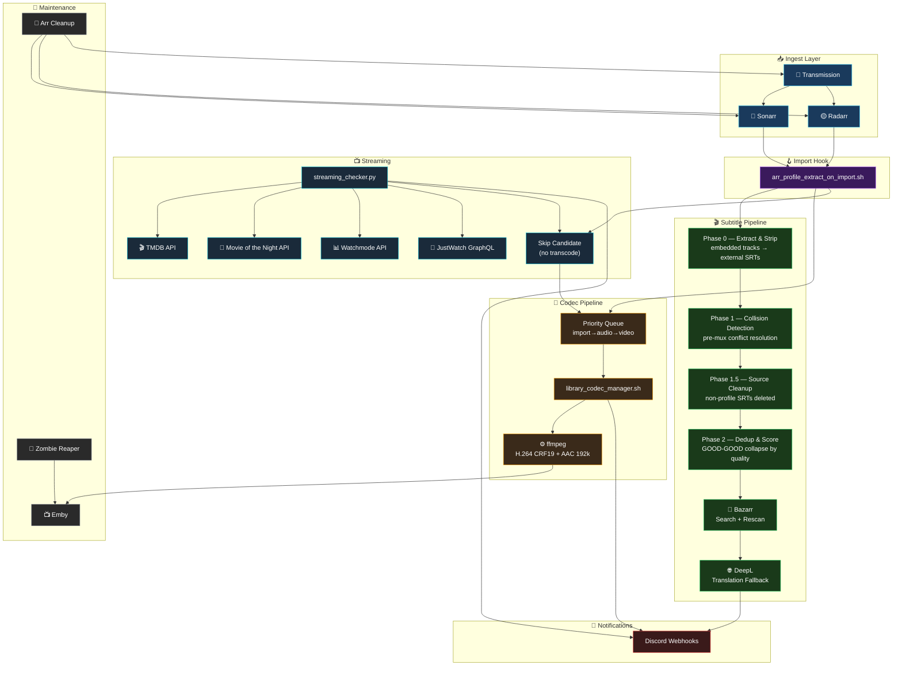
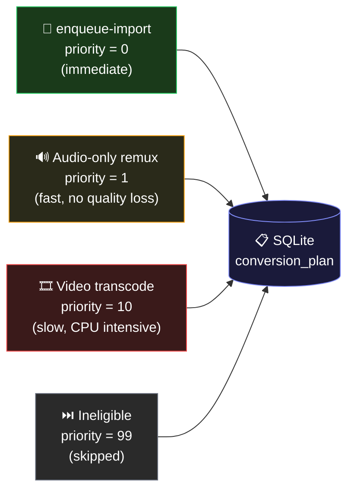
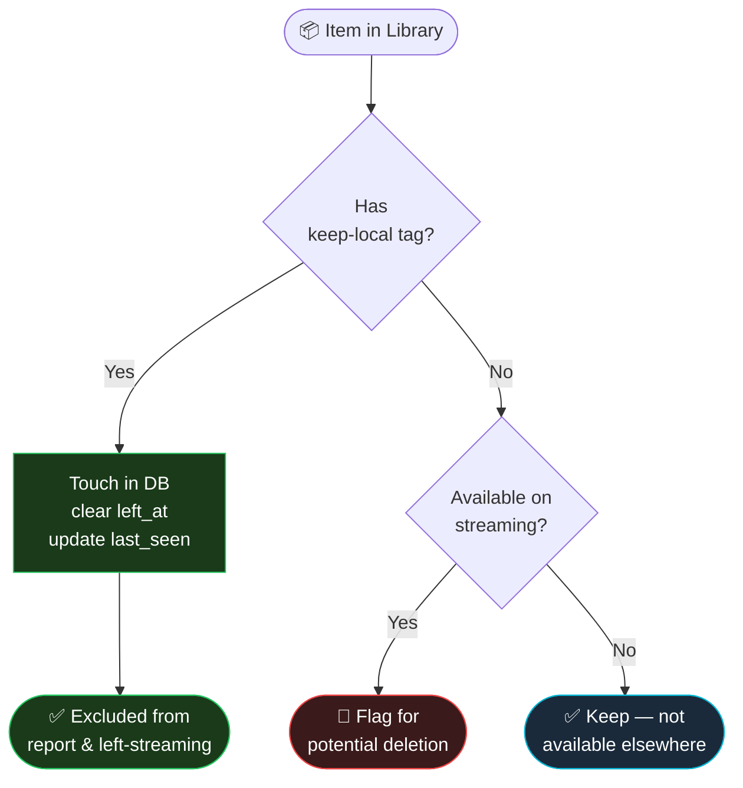
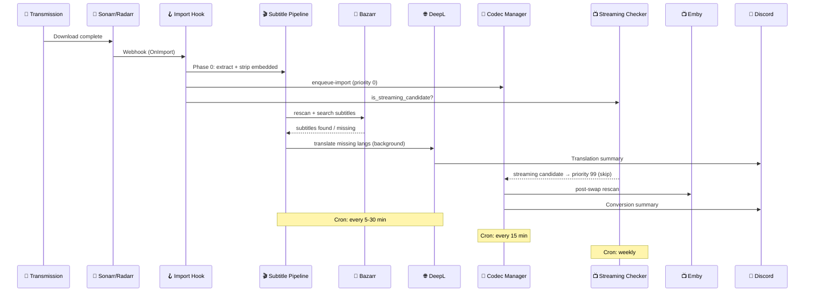

```
╔══════════════════════════════════════════════════════════════════════════════════════════╗
║                                                                                          ║
║   ██████╗ ███████╗██████╗ ███████╗███╗   ██╗███████╗████████╗██╗   ██╗███████╗███████╗   ║
║   ██╔══██╗██╔════╝██╔══██╗██╔════╝████╗  ██║██╔════╝╚══██╔══╝██║   ██║██╔════╝██╔════╝   ║
║   ██████╔╝█████╗  ██████╔╝█████╗  ██╔██╗ ██║███████╗   ██║   ██║   ██║█████╗  █████╗     ║
║   ██╔══██╗██╔══╝  ██╔══██╗██╔══╝  ██║╚██╗██║╚════██║   ██║   ██║   ██║██╔══╝  ██╔══╝     ║
║   ██████╔╝███████╗██║  ██║███████╗██║ ╚████║███████║   ██║   ╚██████╔╝██║     ██║        ║
║   ╚═════╝ ╚══════╝╚═╝  ╚═╝╚══════╝╚═╝  ╚═══╝╚══════╝   ╚═╝    ╚═════╝ ╚═╝     ╚═╝        ║
║                                                                                          ║
║                    🎬  M E D I A  A U T O M A T I O N  S U I T E  🎬                     ║
║                 Sonarr · Radarr · Bazarr · Emby · DeepL · TMDB · Discord                 ║
║                                                                                          ║
╚══════════════════════════════════════════════════════════════════════════════════════════╝
```

<div align="center">

[](https://github.com/beregcamlost/arr_configs)
[](https://github.com/beregcamlost/arr_configs)
[](https://www.gnu.org/software/bash/)
[](https://www.python.org/)
[](https://www.sqlite.org/)
[](https://discord.com/)

[](https://sonarr.tv)
[](https://radarr.video)
[](https://www.bazarr.media)
[](https://emby.media)
[](https://prowlarr.com)
[](https://www.deepl.com)
[](https://www.themoviedatabase.org)
[](https://transmissionbt.com)

[]()
[]()
[]()

</div>

---

> **🏠 Personal media server automation stack** — a battle-tested suite of shell scripts and Python services that automate subtitle management, codec normalization, streaming availability tracking, and library maintenance across a full \*arr ecosystem running on an appbox.

---

## 📋 Table of Contents

- [🗺️ Architecture Overview](#-architecture-overview)
- [⚡ Systems at a Glance](#-systems-at-a-glance)
- [🎬 Subtitle System](#-subtitle-system)
- [🔄 Codec Manager](#-codec-manager)
- [📺 Streaming Checker](#-streaming-checker)
- [🌐 Translation System](#-translation-system)
- [👻 Emby Zombie Reaper](#-emby-zombie-reaper)
- [🧹 Arr Cleanup](#-arr-cleanup)
- [🚫 Grab Monitor](#-grab-monitor)
- [⏰ Cron Schedule](#-cron-schedule)
- [🔌 Integration Flow](#-integration-flow)
- [📁 Repository Structure](#-repository-structure)
- [🛠️ Tech Stack](#-tech-stack)
- [⚙️ Configuration](#-configuration)
- [📖 Operational Lessons](#-operational-lessons)

---

## 🗺️ Architecture Overview



---

## ⚡ Systems at a Glance

| System | Language | Tests | Cron Freq | Notifications |
|--------|----------|-------|-----------|---------------|
| 🎬 Subtitle Manager | Bash | 159 ✅ | 5 min / 10 min / daily | ✅ Discord |
| 🔄 Codec Manager | Bash | — | 15 min / 3 AM daily | ✅ Discord |
| 📺 Streaming Checker | Python | 271 ✅ | Weekly / Monthly | ✅ Discord |
| 🌐 Translation System | Python | 151 ✅ | 30 min | ✅ Discord |
| 👻 Zombie Reaper | Bash | — | 2 min | ✅ Discord |
| 🧹 Arr Cleanup | Bash | — | 30 min | — |
| 🚫 Grab Monitor | Bash | — | 3 min | ✅ Discord |
| 📈 Trending Auto-Add | Python | 21 ✅ | Weekly (DISABLED) | — |
| 💾 SQLite Backup | Bash | — | Every 3 days | — |

<details>
<summary>📊 <strong>Key Numbers</strong></summary>
<br>

| Metric | Value |
|--------|-------|
| 📜 Total cron jobs | 22 |
| 🧪 Total tests | 528 passing |
| 🌐 Translation budget | Gemini primary (13 free keys), DeepL 400K/month fallback, Google last resort |
| 💾 State databases | 6 (codec, streaming, translation, subtitle-quality, bazarr, grab-monitor) |
| 🔌 External APIs | 9 (Sonarr, Radarr, Bazarr, Emby, TMDB, DeepL, MoTN, Watchmode, JustWatch) |
| 📡 Discord webhooks | All systems |
| 🎞️ Target codec | H.264 CRF19 + AAC 192k stereo |
| ⏭️ Skips | UHD / 4K / HDR / streaming candidates / stale candidates |

</details>

---

## 🎬 Subtitle System

> **`automation/scripts/subtitles/`** — The crown jewel. A multi-phase subtitle pipeline that extracts, cleans, deduplicates, and manages subtitles across an entire media library.

### 📂 Key Files

| File | Purpose |
|------|---------|
| `subtitle_quality_manager.sh` | Main entry point — `audit`, `mux`, `strip`, `auto-maintain`, `compliance` subcommands |
| `lib_subtitle_common.sh` | Shared library — language helpers, codec helpers, path classifiers |
| `arr_profile_extract_on_import.sh` | Unified Sonarr + Radarr import hook |
| `library_subtitle_dedupe.sh` | Removes duplicate/low-quality external subs |
| `bazarr_subtitle_recovery.sh` | Retries missing subtitle downloads with translation fallback; Stage 4 (searches exhausted) sends a Discord "⚠️ Stuck Alerts" notification instead of deleting and re-grabbing |

### 🔀 Multi-Phase Pipeline

```mermaid
flowchart LR
    A([📁 New Import]) --> B

    subgraph P0["🔧 Phase 0 — Extract & Strip"]
        B["Extract embedded\ntext tracks → .srt"]
        B2["Strip non-profile\nembedded tracks"]
    end

    subgraph P05["⚖️ Phase 0.5 — Enforce 1-Best"]
        B3["enforce_one_per_lang:\nscore all sources per lang\nkeep best, strip/delete losers"]
    end

    subgraph P1["🛡️ Phase 1 — Collision + Quality"]
        C["Pre-mux collision check\nWARN → mark for upgrade\nBAD → delete + provider cycle"]
    end

    subgraph P175["🌐 Phase 1.75 — Translate Sources"]
        C2["Translate from non-profile\nSRTs before cleanup"]
    end

    subgraph P15["🗑️ Phase 1.5 — Source Cleanup"]
        D["Non-profile SRTs deleted\nonce all langs satisfied"]
    end

    subgraph P2["🏆 Phase 2 — Dedup & Score"]
        E["GOOD-GOOD duplicates\ncollapsed by quality score\nkeeps highest scorer per lang"]
    end

    F([✅ Clean MKV\n+ Quality Subs])

    B --> B2 --> B3 --> C --> C2 --> D --> E --> F

    style P0 fill:#1a3a1a,stroke:#22c55e,color:#fff
    style P05 fill:#2a3a1a,stroke:#84cc16,color:#fff
    style P1 fill:#3a2a1a,stroke:#f59e0b,color:#fff
    style P175 fill:#1a2a3a,stroke:#818cf8,color:#fff
    style P15 fill:#3a1a1a,stroke:#ef4444,color:#fff
    style P2 fill:#1a2a3a,stroke:#06b6d4,color:#fff
```



### ✨ Features

- 🔍 **Language detection** — Python `langdetect` (offline, fast) → DeepL API → Google Translate fallback; renames `und` tracks to actual language
- 🏷️ **Quality scoring** — `subtitle_quality_score()` ranks all sources; `enforce_one_per_lang()` keeps 1-best per language
- ⚠️ **WARN/BAD handling** — WARN subs kept but marked for upgrade; BAD subs deleted immediately with provider/translation cycle
- 🔄 **Upgrade retries** — `needs_upgrade` SQLite table tracks WARN/MISSING subs for daily retry via providers + DeepL
- 📊 **Compliance reporting** — `compliance` subcommand audits entire library against Bazarr profiles (text + JSON output)
- 💧 **Watermark stripping** — removes common watermark lines from SRT files
- 🛡️ **Remux integrity validation** — `validate_streams_match()` verifies video + audio stream counts survive every strip/mux operation; rejects output and keeps original intact on any mismatch
- 🎭 **HI/SDH/CC awareness** — `subtitle_group_key()` looks past hearing-impaired qualifiers for dedup grouping
- 🌊 **Streaming candidate skip** — pre-loaded associative array pattern; zero subprocess calls in hot loops
- 🔄 **Bazarr integration** — `bazarr_rescan_for_file()` + per-language subtitle search after every operation
- 📢 **Rich Discord embeds** — file list, DeepL deferral tracking, per-operation summaries

### ⏱️ Scan Schedule

```
Every  5 min  → subtitle dedupe quick scan      (--since 10 min)
Every ~10 min → subtitle auto-maintain quick    (--since 15 min, staggered at :07/:17/...)
Daily  1 AM   → subtitle auto-maintain full     (entire library)
Weekly Sun 4AM→ subtitle dedupe full            (entire library)
Every ~15 min → bazarr subtitle recovery        (--since 30 min, staggered at :03/:18/...)
```

> 💡 **`--since` logic**: checks both MKV mtime AND SRT mtime (OR logic), so new imports without SRTs are always caught by quick scans.

---

## 🔄 Codec Manager

> **`automation/scripts/transcode/`** — SQLite-backed incremental audit and conversion pipeline. Targets H.264 + AAC normalization while skipping content that shouldn't be touched.

### 📂 Key Files

| File | Purpose |
|------|---------|
| `library_codec_manager.sh` | Main entry — `audit`, `plan`, `convert`, `resume`, `enqueue-import` subcommands |

### 🎯 Conversion Targets

```
Video   →  H.264  CRF 19  (x264)
Audio   →  AAC    192k    stereo normalization
Container → MKV or MP4 (preserved); others remuxed to MKV
```

### ⚡ Priority Queue



### 🚫 Skip Conditions

| Condition | Reason |
|-----------|--------|
| UHD / 4K / HDR | Quality preservation |
| Streaming candidates | No point converting content we might delete |
| Stale candidates | Flagged 90d+ unwatched + on streaming (tier 1.5) |
| Already H.264 + AAC | Nothing to do |
| Currently being converted | Concurrency guard |
| Micro-encode (1080p MKV, BPF < 0.08) | Already-degraded source; transcoding would further harm quality. Logged to `$STATE_DIR/micro_encodes.csv` + Discord alert |

### 📊 Post-Swap Actions

After every successful transcode:
1. ✅ Sonarr/Radarr rescan
2. ✅ Bazarr `scan-disk`
3. ✅ Direct Bazarr DB `audio_language` update (Sonarr `languages` field is immutable after import)
4. ✅ Emby library refresh

---

## 📺 Streaming Checker

> **`automation/scripts/streaming/`** — Python CLI that cross-references the local media library against real-time streaming provider availability. Flags content that's freely available so you can reclaim disk space.

### 🔌 APIs Used (4-Source Voting)

| API | Purpose | Auth |
|-----|---------|------|
| 🎬 TMDB | Primary streaming availability (always votes) | API key |
| 🌙 Movie of the Night (RapidAPI) | Cross-validation voter + per-season availability | API key |
| 📊 Watchmode | Cross-validation voter | API key |
| 🎯 JustWatch (GraphQL) | Cross-validation voter (TMDB's upstream source) | None needed |
| 📺 Emby Activity Log | Last-played timestamps for staleness detection | API key |

> **Default providers:** Netflix, Disney+, Crunchyroll (CL region)

### 📟 CLI Subcommands

```bash
streaming scan              # Refresh availability from APIs
streaming report            # Show what's available on streaming
streaming confirm-delete    # Mark items for deletion
streaming check-seasons     # Per-season streaming breakdown
streaming stale-flag        # Tier 1.5: flag 90d+ unwatched items on streaming
streaming stale-delete      # Tier 1.5: delete flagged items after 15d grace
streaming stale-cleanup     # Tier 2: yearly stale cleanup
streaming summary           # Per-provider and per-library stats
streaming providers         # List known providers
```

### 🏷️ Keep-Local Logic



### 🧪 Test Coverage

```
271 tests passing
├── 96  streaming core tests
├── 33  keep-local filtering tests
├── 27  cross-validation voting tests (4-source model)
├── 21  trending auto-add tests
├── 20  JustWatch client tests
├── 15  per-season streaming tests
├── 14  left-streaming tracking tests
├── 12  Discord notification tests
├── 10  stale flag/delete tests
├──  8  CLI argument tests
├──  5  Crunchyroll addon detection tests
└── 10  miscellaneous utility tests
```

---

## 🌐 Translation System

> **`automation/scripts/translation/`** — Automatic subtitle translation for missing profile languages using Gemini, DeepL, and Google Translate. Bridges the gap when Bazarr can't find subtitles in the required language.

### 🧠 Smart Source Selection

```
1. Gather all non-forced external SRTs for the file
2. Pick the largest one (most content)
3. If an English SRT exists and is within 20% of the largest → prefer English
4. Translate → target language SRT
5. 24h cooldown per (file, language) pair to avoid hammering the API
```

### 🔀 Two Entry Points

```
cron every 30 min
  └── translate --since 60
        queries Bazarr DB for missing_subtitles
        translates in batch

Import Hook (background, async)
  └── translate --file /path/to/media.mkv
        triggered immediately after import
        runs detached (</dev/null & disown)
```

### 📊 Budget & Quota Management

| Metric | Value |
|--------|-------|
| Primary | Gemini 2.5 Pro/Flash (13 free API keys, 1500 req/day each) |
| Fallback | DeepL Pro API (400K chars/month budget cap) |
| Last resort | Google Translate (free, unofficial API) |
| Cooldown | 24h per (file, language) |
| Discord alert | Quota warning webhook on low balance |
| Override | `--monthly-budget 0` for unlimited (manual only) |

### 🧪 Test Coverage

```
151 tests passing
├── Provider fallback chain (Gemini → DeepL → Google)
├── CLI argument handling
├── Source SRT selection logic
├── State DB cooldown enforcement
├── Bazarr DB profile + missing_subtitles parsing
├── Gemini multi-key rotation + model fallback
├── Google Translate error recovery
└── Language code mapping validation
```

---

## 👻 Emby Zombie Reaper

> **`emby_zombie_reaper.sh`** — Hunts down and terminates idle or paused Emby sessions that have overstayed their welcome.

### ⚙️ Behavior

| Trigger | Action |
|---------|--------|
| Session idle > 5 hours | 💀 Kill session |
| 20 zombie kills accumulated | 🔄 Auto-restart Emby |
| Every Tuesday 05:03 UTC | 🔄 Weekly safety restart |

### 🔍 State Tracking

- Tracks kill counts across invocations in state file
- Sends Discord notification on auto-restart
- Staggered cron timing (`2,32 *`) avoids collision with codec audit at `0 3 * * *`

---

## 🧹 Arr Cleanup

> **`arr_cleanup_importblocked.sh`** — Evicts stale "already imported" queue entries from Sonarr and Radarr, and removes the corresponding torrents from Transmission.

### ⚙️ What It Does

```
Every 30 minutes (at :12 and :42):
  1. Query Sonarr + Radarr for queue items in "importBlocked" status
  2. Blocklist queue items with executable extensions (.exe, .msi, etc.)
  3. Remove matching entries from arr queues
  4. Delete corresponding torrents from Transmission
  5. Free up queue space for new downloads
```

---

## 🚫 Grab Monitor

> **`automation/scripts/grab-monitor.sh`** — Enforces a language policy at download time. Monitors recent grabs from Sonarr and Radarr and removes any download whose detected audio languages fall outside the allowed set.

### 🎯 Allowed Languages Per Item

```
{Original language of the series/movie} ∪ {English} ∪ {Spanish} ∪ {Spanish Latino}
```

- **Attack on Titan** (Japanese-origin): Japanese + English + Spanish → allowed ✅
- **Amélie** (French-origin): French + English → allowed ✅
- **Rooster** (English-origin): French + English MULTI → **blocked** ✅

### ⚙️ How It Works

```
Every 3 minutes:
  1. Query Sonarr + Radarr history for grabs in the last 5 minutes
  2. For each grab: look up the series/movie original language via API
  3. Build allowed set: {originalLang, English, Spanish, Spanish Latino}
  4. If any parsed language is outside the allowed set:
     → Remove torrent from Transmission
     → Discord notification with violation details
     → Log action to state dir
  5. Mark all processed grabs as seen (SQLite) to avoid reprocessing
```

### 📂 Key Files

| File | Purpose |
|------|---------|
| `automation/scripts/grab-monitor.sh` | Canonical script |
| `scripts/grab-monitor.sh` | Compat copy (used by cron) |

### 📋 State

- **State DB**: `/APPBOX_DATA/storage/.grab-monitor-state/seen.db`
- **Log**: `/APPBOX_DATA/storage/.grab-monitor-state/grab-monitor.log`

---

## ⏰ Cron Schedule

> All jobs use `flock` for concurrency control. Subtitle dedupe + auto-maintain share a flock group. DeepL has its own. Codec manager has its own.

```mermaid
gantt
    title Cron Job Schedule (24-hour view)
    dateFormat HH:mm
    axisFormat %H:%M

    section Subtitles
    Dedupe quick (every 5m)     :active, 00:00, 24:00
    Auto-maintain quick (~10m staggered)   :active, 00:00, 24:00
    Bazarr recovery (~15m staggered)       :active, 00:00, 24:00
    Auto-maintain full          :milestone, 01:00, 0m

    section Codec
    Resume (every 15m)          :active, 00:00, 24:00
    Audit + Plan                :milestone, 03:00, 0m

    section Streaming
    Emby last played (Tue)      :milestone, 03:35, 0m

    section Emby
    Zombie reaper (2,32)        :active, 00:00, 24:00
    Weekly restart (Tue)        :milestone, 05:03, 0m

    section Translation
    DeepL translate (30m)       :active, 00:00, 24:00

    section Cleanup
    Arr import-blocked (30m)    :active, 00:00, 24:00
```



| Schedule | Job | System | Notes |
|----------|-----|--------|-------|
| `*/3 * * * *` | 🚫 Grab monitor | Language Guard | Removes MULTI/foreign-language bad grabs |
| `*/5 * * * *` | 🎬 Subtitle dedupe quick | Subtitles | `--since 10` min |
| `7,17,27,37,47,57 * * * *` | 🎬 Subtitle auto-maintain quick | Subtitles | `--since 15` min |
| `3,18,33,48 * * * *` | 🎬 Bazarr subtitle recovery | Subtitles | `--since 30` min |
| `0 1 * * *` | 🎬 Subtitle auto-maintain full | Subtitles | Full library scan (checks SRT mtimes) |
| `0 4 * * 0` | 🎬 Subtitle dedupe full | Subtitles | Weekly, Sunday 4 AM |
| `*/15 * * * *` | 🔄 Codec manager resume | Codec | Batch size 1 |
| `0 3 * * *` | 🔄 Codec audit + plan | Codec | Incremental, ~7 min |
| `*/30 * * * *` | 🌐 DeepL translation | Translation | `--since 60` min |
| `12,42 * * * *` | 🧹 Arr import-blocked cleanup | Cleanup | — |
| `0 5 * * 0` | 📺 Streaming availability scan | Streaming | Weekly, Sunday 5 AM |
| `30 5 * * 0` | 📺 Tier 1.5: stale flag (90d unwatched) | Streaming | Weekly, Sunday 5:30 AM |
| `0 6 * * 0` | 📺 Tier 1: streaming cleanup | Streaming | Weekly, Sunday 6 AM (DISABLED) |
| `30 6 * * 0` | 📺 Tier 1.5: stale delete (15d grace) | Streaming | Weekly, Sunday 6:30 AM |
| `0 7 1 * *` | 📺 Tier 2: stale cleanup (365d, >3GB) | Streaming | Monthly, 1st 7 AM |
| `2,32 * * * *` | 👻 Emby zombie reaper | Emby | Staggered |
| `3 5 * * 2` | 👻 Emby weekly restart | Emby | Tuesday 05:03 UTC |
| `35 3 * * 2` | 📊 Emby last played report | Reports | Tuesday 03:35 UTC |
| `0 4 * * *` | 🔍 Verify disputed streaming | Streaming | Cross-validation voting |
| `50 3 * * 1` | 🔵 Bazarr weekly restart | Maintenance | Monday — prevents FD leak exhaustion |
| `50 3 * * 3` | 🔵 Sonarr weekly restart | Maintenance | Wednesday — prevents .NET memory growth |
| `50 3 * * 4` | 🟡 Radarr weekly restart | Maintenance | Thursday — prevents .NET memory growth |
| `0 2 */3 * *` | 💾 SQLite backup | Maintenance | All state DBs |

---

## 🔌 Integration Flow



---

## 📁 Repository Structure

```
📦 berenstuff/
├── 📄 .env                          # All secrets (never committed)
├── 📄 CLAUDE.md                     # Development conventions
│
├── 📂 apps/                         # App config backups
│   ├── 📂 bazarr_data/
│   ├── 📂 radarr_config/
│   └── 📂 sonarr_config/
│
├── 📂 automation/
│   ├── 📂 configs/                  # Tracked configs & crontab
│   │   ├── 📄 crontab.env-sourced  # 22 cron jobs (install with: crontab <file>)
│   │   ├── 📄 bazarr-config.yaml
│   │   ├── 📄 radarr-config.xml
│   │   └── 📄 sonarr-config.xml
│   │
│   ├── 📂 docs/                     # Runbooks and design docs
│   ├── 📂 logs/                     # All cron/script logs
│   │
│   └── 📂 scripts/
│       ├── 📂 subtitles/            # 🎬 Subtitle system (bash)
│       │   ├── subtitle_quality_manager.sh
│       │   ├── lib_subtitle_common.sh
│       │   ├── arr_profile_extract_on_import.sh
│       │   ├── library_subtitle_dedupe.sh
│       │   └── bazarr_subtitle_recovery.sh
│       │
│       ├── 📂 transcode/            # 🔄 Codec manager (bash)
│       │   └── library_codec_manager.sh
│       │
│       ├── 📂 streaming/            # 📺 Streaming checker (python)
│       │   ├── streaming_checker.py
│       │   └── justwatch_client.py
│       │
│       ├── 📂 translation/          # 🌐 DeepL translator (python)
│       │
│       ├── 📄 arr_cleanup_importblocked.sh
│       ├── 📄 grab-monitor.sh
│       ├── 📄 emby_zombie_reaper.sh
│       └── 📄 emby_last_played_report.sh
│
├── 📂 backups/                      # Config backups
└── 📂 scripts/                      # Compat copies for Sonarr/Radarr hooks
```

---

## 🛠️ Tech Stack

<div align="center">

| Layer | Technology | Purpose |
|-------|-----------|---------|
| 🐚 Shell | Bash 5+ (`set -euo pipefail`) | Core automation scripts |
| 🐍 Python | Python 3 + Click | Streaming checker + translator |
| 🗄️ State | SQLite (5 databases) | Codec plans, streaming index, translation, subtitle quality state |
| 🎞️ Media | ffprobe / ffmpeg | Media analysis and conversion |
| 🔗 *arr APIs | Sonarr · Radarr · Bazarr | Library management |
| 📺 Server | Emby | Media server |
| 🧲 Torrents | Transmission | Download client |
| 🎬 Metadata | TMDB API | Streaming availability data |
| 🌙 Streaming | Movie of the Night (RapidAPI) | Per-season availability + cross-validation |
| 📊 Streaming | Watchmode API | Cross-validation voter |
| 🎯 Streaming | JustWatch GraphQL | Cross-validation voter (no API key) |
| 🌐 Translation | Gemini + DeepL Pro + Google Translate | Subtitle translation (Gemini primary, DeepL fallback, Google last resort) |
| 🔔 Alerts | Discord Webhooks | All system notifications |
| 🔒 Concurrency | `flock` | Cron job mutual exclusion |
| 🔍 Indexers | Prowlarr (23 indexers) | Torrent search |

</div>

---

## ⚙️ Configuration

### 🔑 Environment (`.env`)

All secrets live in `.env` and are sourced by cron via the env-sourced crontab. Never committed to git.

```bash
# *arr APIs
SONARR_API_KEY=...
RADARR_API_KEY=...
BAZARR_API_KEY=...
EMBY_API_KEY=...
PROWLARR_API_KEY=...

# External APIs
DEEPL_API_KEY=...             # Pro tier (no :fx suffix)
TMDB_API_KEY=...
RAPIDAPI_KEY=...             # Movie of the Night

# Webhooks
DISCORD_WEBHOOK_URL=...

# Paths
APPBOX_DATA=/APPBOX_DATA/storage
```

### 📦 Installing Crontab

```bash
# NEVER use sed piped to crontab -
# Always edit the tracked file, then install:
crontab automation/configs/crontab.env-sourced
```

---

## 📖 Operational Lessons

> Hard-won lessons from running this stack in production. Each one cost debugging time.

<details>
<summary>🚨 <strong>Critical: Never pipe sed to crontab -</strong></summary>

Complex cron lines with pipes/quotes/escapes break sed patterns and **can wipe the entire crontab**. Always edit `automation/configs/crontab.env-sourced` then install with `crontab <file>`.

</details>

<details>
<summary>🔄 <strong>Always `</dev/null` for external commands in while-read loops</strong></summary>

`ffmpeg`, `sqlite3`, `curl`, and other tools can consume bytes from process substitution pipes (e.g., `find | sort`), causing truncated paths or skipped iterations. Best practice: pre-load data into bash arrays before the loop, or add `</dev/null` to every external command inside the loop body.

</details>

<details>
<summary>🔇 <strong>`flock -n` silently exits</strong></summary>

When cron jobs use non-blocking flock and another process holds the lock, the invocation exits with code 1 and writes nothing to the log. This is by design. Don't mistake silent flock skips for stalled jobs.

</details>

<details>
<summary>🗄️ <strong>SQLite queries fail when DB is locked by active process</strong></summary>

The codec converter holds a WAL lock during ffmpeg runs. `sqlite3` CLI from another process hits `busy_timeout` and may return empty results. Check if a conversion is running before concluding the DB is empty.

</details>

<details>
<summary>📍 <strong>Codec manager DB has `-media` suffix</strong></summary>

Actual path: `/APPBOX_DATA/storage/.transcode-state-media/` (not `.transcode-state/`).

</details>

<details>
<summary>🔧 <strong>Sonarr `languages` field is immutable after import</strong></summary>

`PUT /api/v3/episodefile` returns 202 but doesn't update `languages`. Bazarr reads `audio_language` from this field. Fix: write directly to Bazarr DB after codec conversion.

</details>

<details>
<summary>🐛 <strong>PRAGMA busy_timeout output leaks into queries</strong></summary>

`sqlite3 "PRAGMA busy_timeout=30000; SELECT ..."` prints `30000` before the SELECT result. Fix: pipe through `tail -1` and guard against the `"30000"` value. Caused `set -e` failures in full scan mode.

</details>

<details>
<summary>🗑️ <strong>Orphaned temp files pollute find scans</strong></summary>

Interrupted ffmpeg operations leave temp files (`.striptmp.*`, `.bloattmp.*`, `.subtmp.*`, `.collisiontmp.*`). Four-layer fix: (1) all temp files use dot-prefix (e.g. `.Movie.striptmp.mkv`) so Radarr/Emby skip them — prevents metadata orphans, (2) auto-cleanup at scan start removes stale temps older than 1 hour, (3) `! -name "*tmp.*"` in all find patterns, (4) normal success path cleans up immediately.

</details>

<details>
<summary>🔢 <strong>`grep -c || echo 0` outputs double zero</strong></summary>

`grep -c` exits 1 AND outputs `0` when no matches, then `|| echo 0` fires, producing `0\n0`. Fix:
```bash
cue_count="$(grep -cE ... 2>/dev/null)" || cue_count=0
```
Caused `analyze_srt_file()` failures in full scan mode.

</details>

---

<div align="center">

---

```
╔════════════════════════════════════════════════╗
║   Built with ☕, bash, and questionable        ║
║   late-night automation decisions.             ║
║                                                ║
║   Private repo — beregcamlost/arr_configs      ║
╚════════════════════════════════════════════════╝
```

[](https://github.com/beregcamlost/arr_configs)

</div>
